[](https://www.ezurio.com/)

# RS26x AWS Codec

[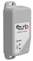](https://www.ezurio.com/iot-devices/lorawan-iot-devices/rs26x-sensor)
[](https://www.aws.com/)

This is the release page for the Ezurio [RS26x][RS26x product brief] product family Codec for AWS.

# Contents

Repository Releases include the following files.

| File Name                                  | Description                                                   |
|--------------------------------------------|---------------------------------------------------------------|
| RS26x_AWS_Downlink.js                      | Downlink Encoder with commented JavaScript code.              |
| RS26x_AWS_Downlink_Uncommented.js          | Downlink Encoder with comments removed.                       |
| RS26x_AWS_Uplink.js                        | Uplink Decoder with commented JavaScript code.                |
| RS26x_AWS_Uplink_Uncommented.js            | Uplink Decoder with comments removed.                         |

Either file version can be integrated within AWS, depending upon developer preference.

# Integration

The codec integrates with AWS IoT Core for LoRaWAN through MQTT topics, Lambda functions, and routing rules. 
Codec support is added on a per [IoT Core for LoRaWAN Destination][Add destinations to AWS IoT Core for LoRaWAN] basis.

**Uplink flow**

When an RS26x device transmits an uplink, the assigned Destination routes the message to a root MQTT topic. This topic carries the raw payload in base-64 along with metadata. A [Rule][Create rules to process LoRaWAN device messages] then triggers the Uplink Decoder Lambda, which converts the payload into decoded JSON and republishes it to a dedicated decoded topic. The Destination is defined when the [device is added to IoT Core for LoRaWAN][Add device to AWS IoT Core for LoRaWAN].

**Downlink flow**

For downlink messages, applications publish requests to a dedicated downlink topic. A Rule invokes the Downlink Encoder Lambda, which encodes the request and places it into the IoT Core for LoRaWAN downlink queue. The message is delivered to the RS26x device during its next uplink receive window. Any responses—whether acknowledgments or application data—are published to the uplink message topic..

Associated entities are shown below.

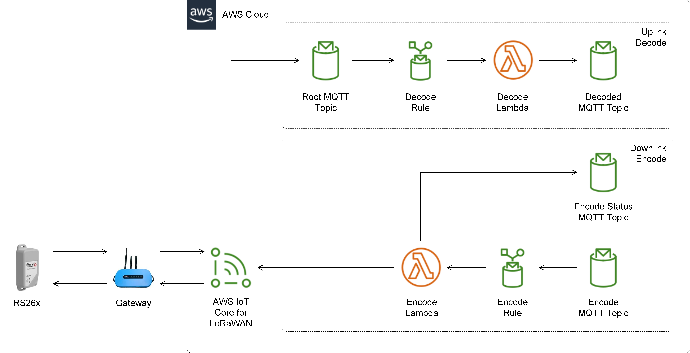

## Prerequisites

The following are required prior to integrating uplink message decode and downlink message encode support.

### Adding a Destination to consume device traffic

A Destination should first be created for assignment during addition of an RS26x device to IoT Core for LoRaWAN. From the 'LPWAN devices' option in the IoT Core tree view, the 'Destinations' item should be selected. 'Add destination' should be clicked, as shown below.

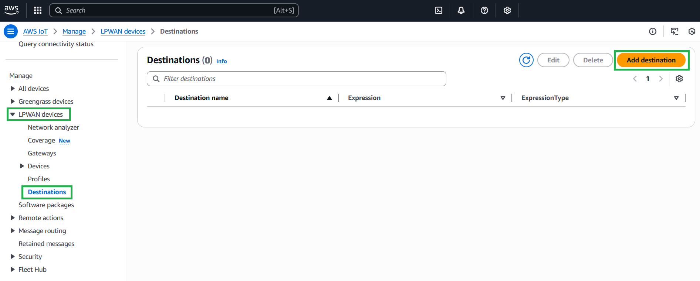

The 'Add destination' page is then displayed, as shown below. A suitable name should be added for 'Destination name'. The root MQTT topic where undecoded messages will be forwarded is enabled by clicking 'Publish to AWS IoT Core message broker', then entering a suitable name for the root topic. Under 'Permissions', 'Create a new service role' should be clicked. Other items can be left at default values, and 'Add destination' clicked.

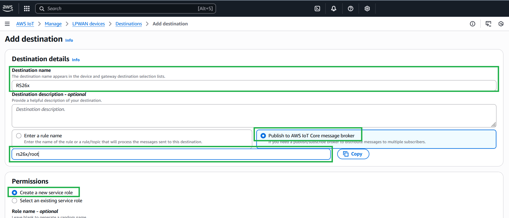

Available Destinations are then summarised as shown below.

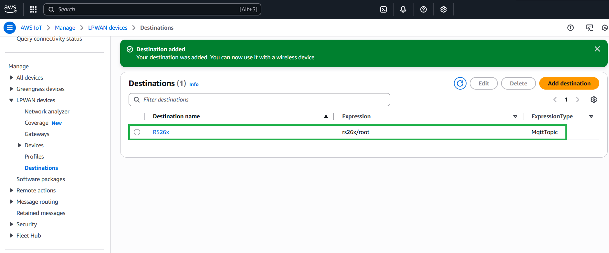

### Adding a Device Profile for device assignment

Each device added to IoT Core for LoRaWAN must have a Device Profile associated with it. This describes the high level details of the device being added (e.g. LoRaWAN region and behaviour). From the 'LPWAN devices' option in the IoT Core tree view, 'Profiles' should be selected, then 'Add device profile' clicked, as shown below.

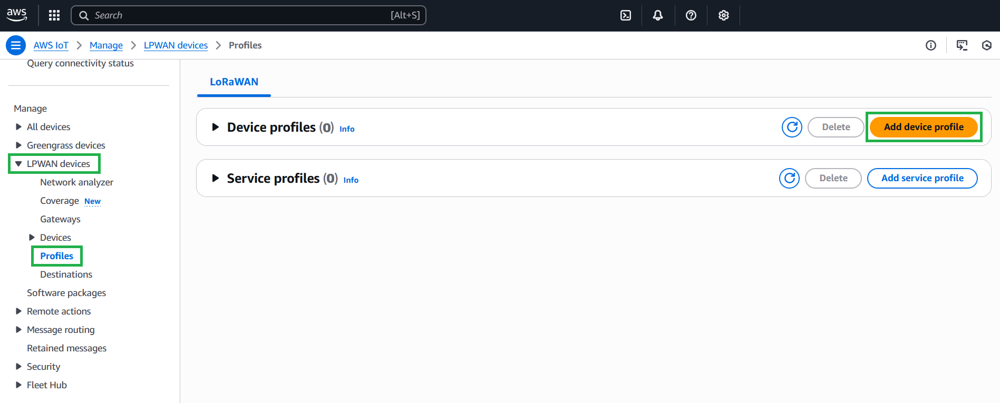

The Device Profile details can then be entered, as shown below.

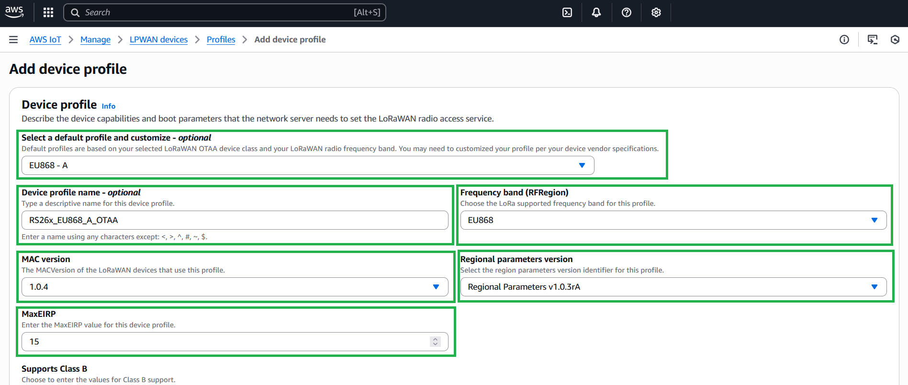

Values entered are determined by the device type intended to be associated with the Device Profile as follows.

| RS26x model | Select a default profile and customise | Frequency band (RFRegion) | MaxEIRP |
|:-----------:|:--------------------------------------:|:-------------------------:|:-------:|
| RS261 EU868 |        EU868-A                         |       EU868               |   15    |
| RS262 AU915 |        AU915-A                         |       AU915               |   24    |
| RS262 AU923 |        AS923-1-A                       |       AS923-1             |   16    |
| RS262 NZ923 |        AS923-1-A                       |       AS923-1             |   16    |
| RS262 US915 |        US915-A                         |       US915               |   24    |

For all RS26x variants, the following fields are common.

* 'MAC version': '1.0.4'

* 'Regional parameters version': 'Regional Parameters v1.0.3rA'

A suitable name should be entered for the Device Profile. Other fields can be left at default values. The 'Add device profile' button can then be clicked.

Available Device Profiles are then summarised as shown below.

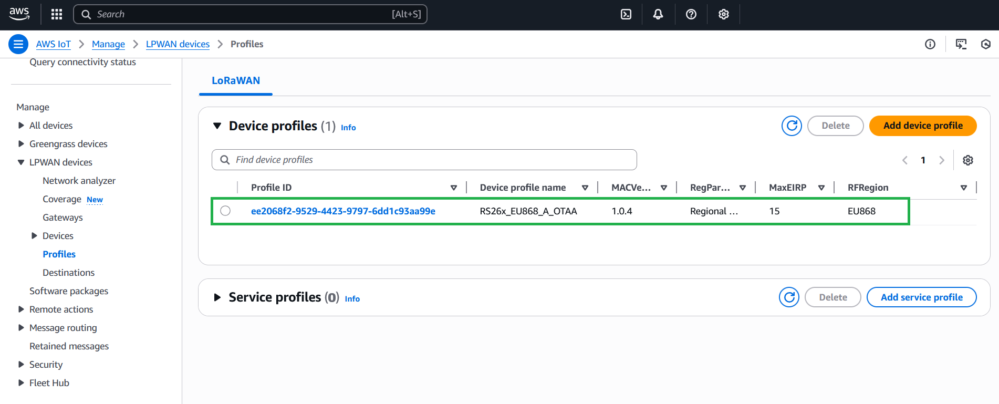

### Adding a Service Profile for device assignment

Each device added to IoT Core for LoRaWAN must also have a Service Profile associated with it. The Service Profile allows devices associated with the Service Profile to have their network behaviour finely controlled. Data Rate and Power limitations can be applied to the devices to conserve battery life or improve connectivity if far from the installation gateways.

From the 'LPWAN devices' option in the IoT Core tree view, 'Profiles' should be selected, then 'Add service profile' clicked, as shown below.

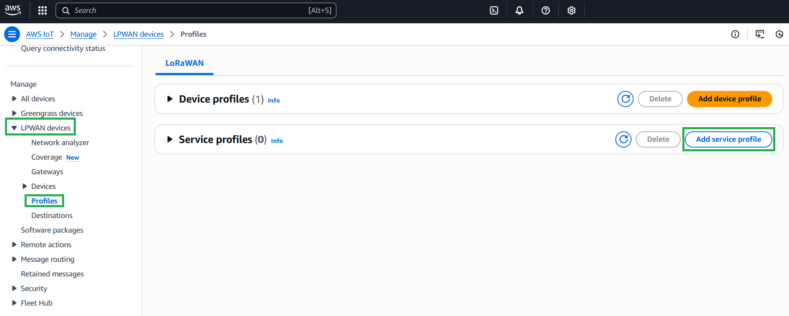

Following entering a suitable name for the Service Profile, desired Adaptive Data Rate details should be entered, as shown below.

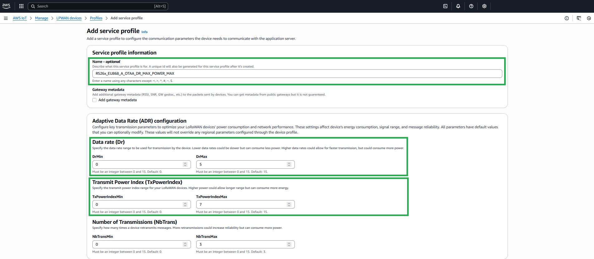

Maximum and minimum allowable values are dependent upon the region of the device being associated with the Service Profile, as follows.

| RS26x model |  DrMin | DrMax | TxPowerIndexMin | TxPowerIndexMax |
|:-----------:|:------:|:-----:|:---------------:|:---------------:|
| RS261 EU868 |   0    |   5   |       0         |       7         |
| RS262 AU915 |   0    |   5   |       0         |      14         |
| RS262 AU923 |   0    |   5   |       0         |       7         |
| RS262 NZ923 |   0    |   5   |       0         |       7         |
| RS262 US915 |   0    |   3   |       0         |      14         |

Other fields can be left at default values, then 'Add service profile' clicked.

A summary of available Service Profiles is then displayed as shown below.

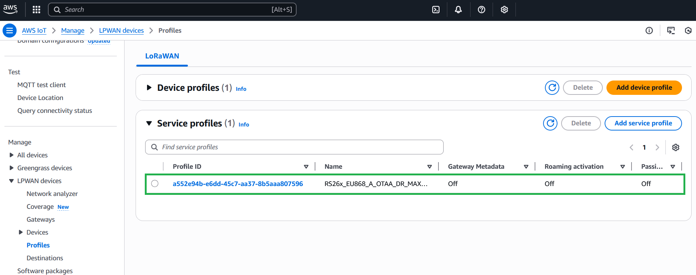

### Adding a device to IoT Core for LoRaWAN

A device can now be added to IoT Core for LoRaWAN and associated with the Destination, Device Profile and Service Profile. Note that an EU868 RS261 device is being used. Configuration of the Device Profile and Service Profile should be adjusted as per the device being used.

From the 'LPWAN devices' option in the IoT Core tree view, 'Devices' should be selected, then 'Add wireless device' clicked, as shown below.

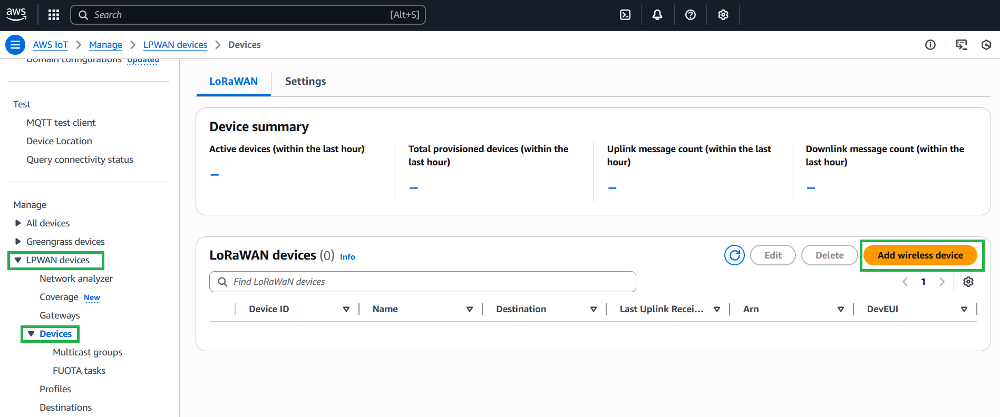

The device credentials should first be added, as shown below. AppKey and JoinEUI information are provided on removeable labels. The DevEUI is always available on the fixed label on the reverse of the device. 'Wireless device specification' should be set to 'OTAA v1.0.x'. The DevEUI should be set to the value on device label and AppKey to the value on the removeable label. The 'AppEUI/JoinEUI' dropdown should be set to 'JoinEUI' then JoinEUI value on the removeable label added. A suitable name should then be entered for the device.

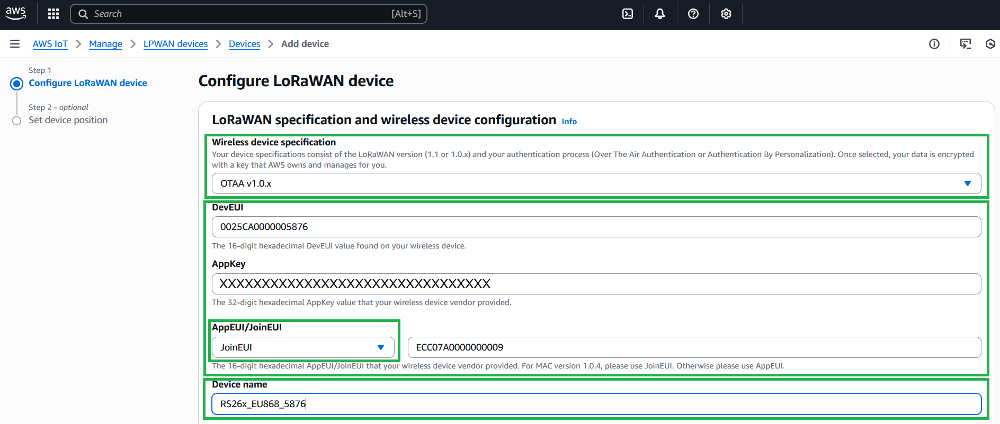

Details of the Device and Service Profile to use, and Destination for the device uplinks are entered further down the page, as shown below.

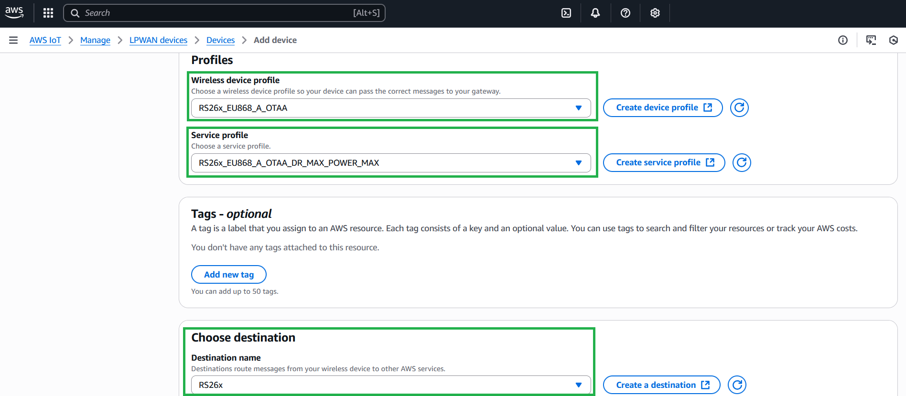

The fields should be set to the Profile and Destination names created earlier, then 'Next' clicked.

Fields on the next page can be left at default values, then 'Add device' clicked.

A summary of available devices is then displayed, as shown below.

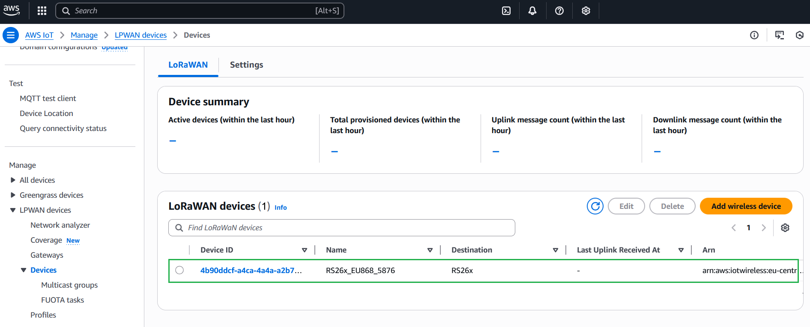

### Viewing uplink messages at root topic

The MQTT Test Client within IoT Core is used to view uplink messages arriving at the root MQTT topic. From the IoT Core tree view menu, under 'Test', 'MQTT test client' should be clicked, as shown below.

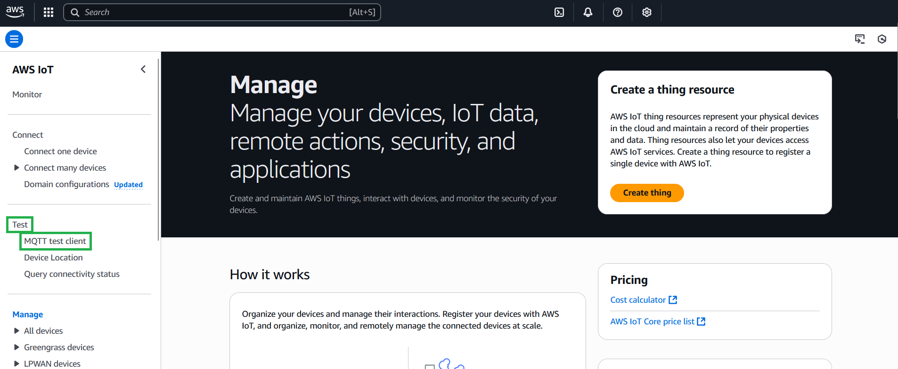

In the 'Subscribe to a topic' group, the name of the root topic should be entered, then 'Subscribe' clicked, as shown below.

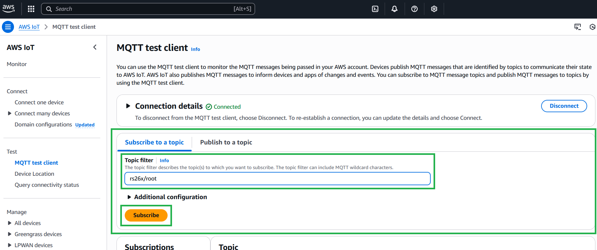

Incoming uplink messages are then displayed. It should be noted that payload information is in base-64 format, as shown below.

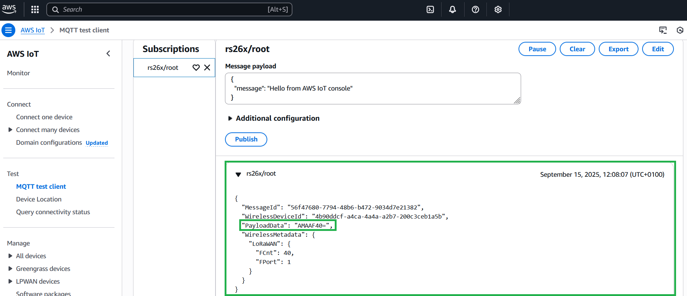

## Adding uplink Decode support

The following describe the steps needed to add message Decode support.

### Adding the Decoder Lambda function

From the main AWS Console page, 'Lambda' should be selected from the 'Compute' group, as shown below.

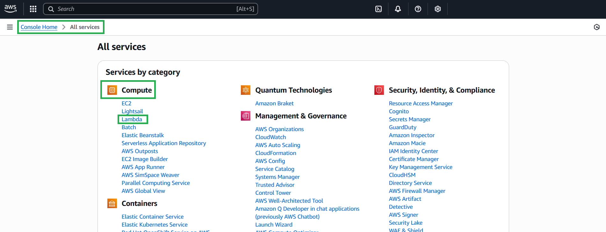

A summary of available Lambda functions is then displayed, as shown below. 'Create function' should be clicked to add the Decode Lambda.

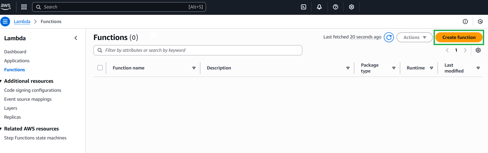

The 'Create function' page is then displayed as shown below. 'Author from scratch' should be selected, and 'Node.js 22.x' selected for 'Runtime'. A suitable name should be entered for the Lambda function. Other fields can be left at default values, then 'Create function' clicked.

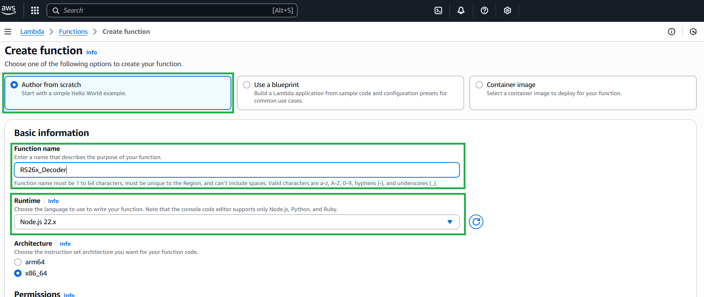

The Lambda Overview is then displayed, as shown below. To the foot of the page, the 'Code' tab is used to modify the Lambda code. The 'Test' feature allows the Lambda code to be executed and tested in isolation. The 'Copy ARN' button to the top right should also be noted. This is used to obtain a unique identifier for the Lambda and is used later in associating an IoT Core Rule with the Lambda.

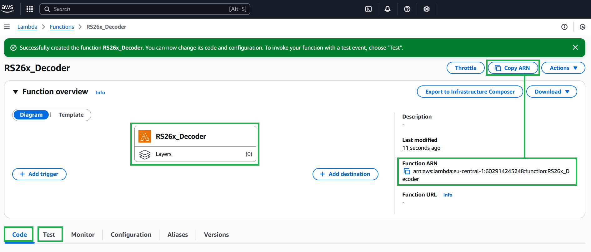

The code from the Commented or Uncommented version of the RS26x_AWS_Uplink file should be copied into the 'Code' pane and 'Deploy' clicked, as shown below.

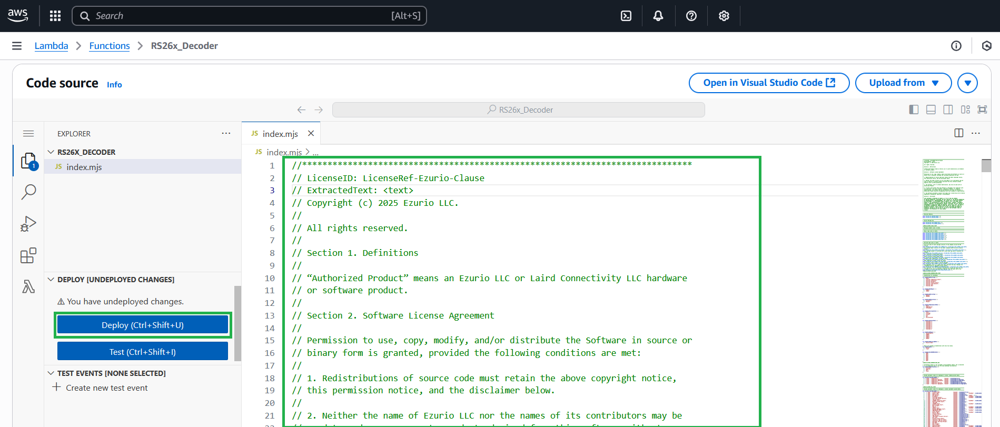

### Adding the Decoder Rule

A Rule is now created to invoke the Decoder Lambda upon uplink messages being received at the root MQTT topic. From the IoT Core tree view menu, 'Rules' should be selected from the 'Message routing' item, then 'Create rule' clicked, as shown below.

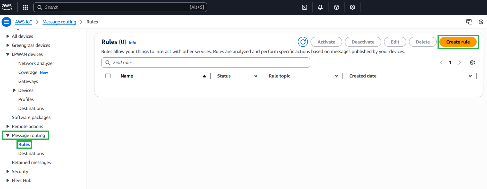

A suitable name should be entered for the Rule, then 'Next' clicked, as shown below.

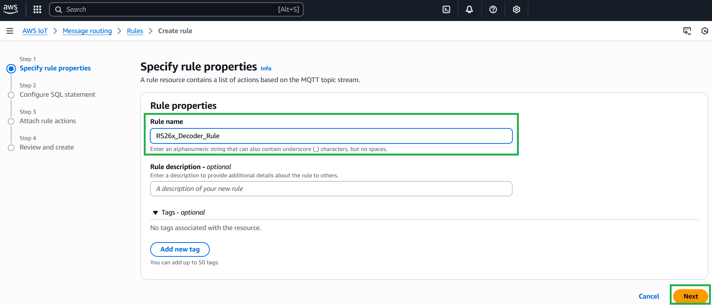

A SQL statement is then entered to route MQTT traffic to the Decoder Lambda function, as shown below.

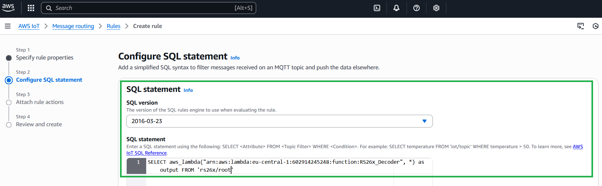

The SQL statement is of the form shown below.

```
SELECT aws_lambda("<Lambda ARN>", *) as output FROM '<root topic>'
```
Text within, and including chevrons, is intended for replacement. The 'Lambda ARN' is available from the Decoder Lambda page, the 'root topic' from the Destination associated with the RS26x device.

The 'Next' button can then be clicked.

Rule Actions are then added to the Rule to determine actions performed when the Rule is invoked. For Action 1, 'Lambda' is selected followed by the name of the Decoder Lambda, as shown below. 'Add rule action' should then be clicked to add another Action.

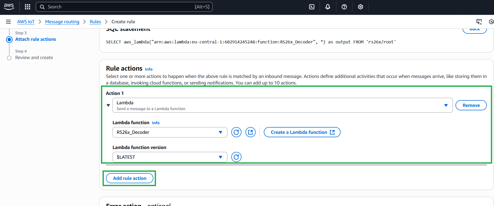

An MQTT topic is then added where Decoded messages will be published. For 'Action 2', 'Republish to AWS IoT topic' should be selected, as shown below. A suitable name should be added for the MQTT topic where decoded uplink messages will be published.

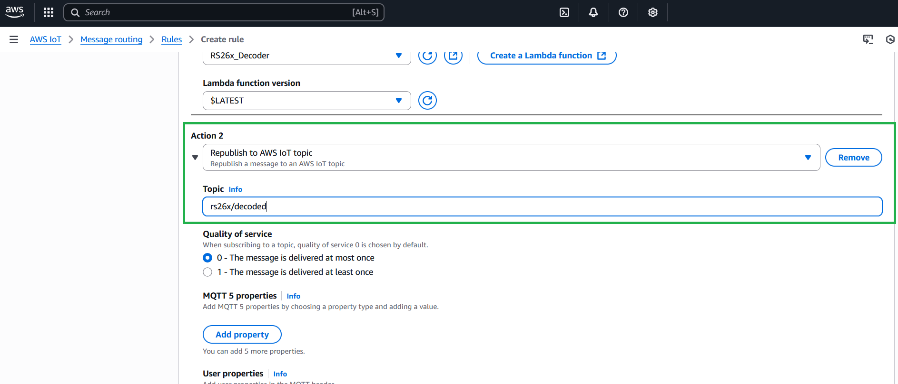

A Role must now be created for the Rule. Under 'Action 2', 'Create new role' should be clicked, as shown below, and a suitable name entered for the Role. 'Create role' can then be clicked. Upon return to the 'Attach rule actions' page, 'Next' should be clicked.

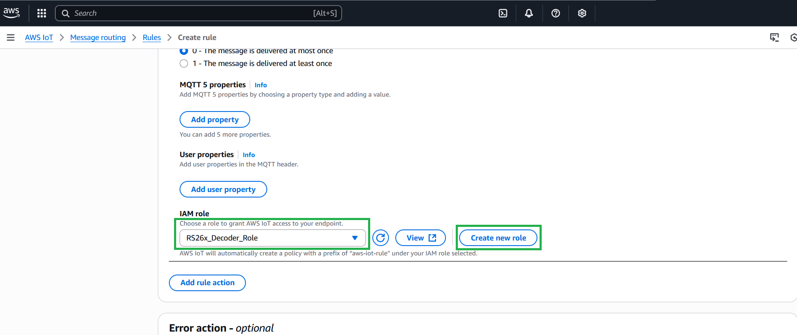

A summary of the Rule is then displayed, as shown below. 'Create Rule' can then be clicked to finalise creation of the Rule.

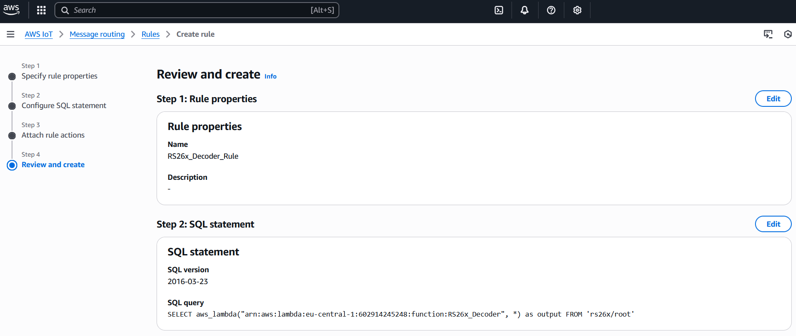

A summary of all available Rules is then displayed, as shown below.

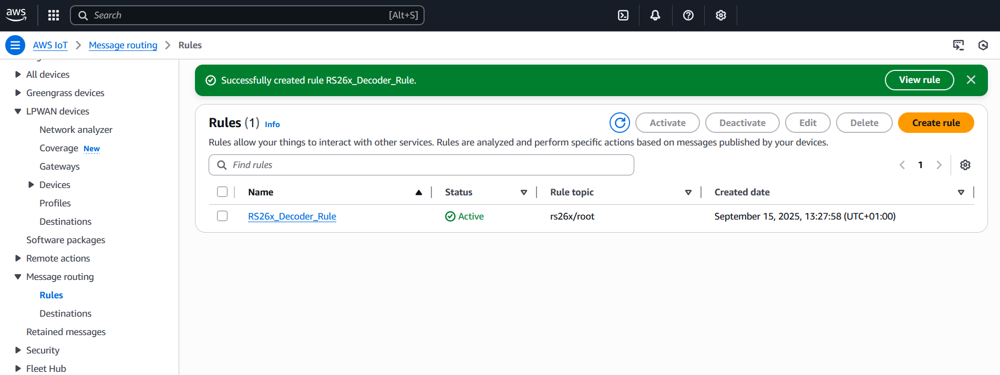

### Viewing Decoded uplink messages

In the MQTT Test Client, a subscription should be created to the topic where decoded messages will be published, as shown below.

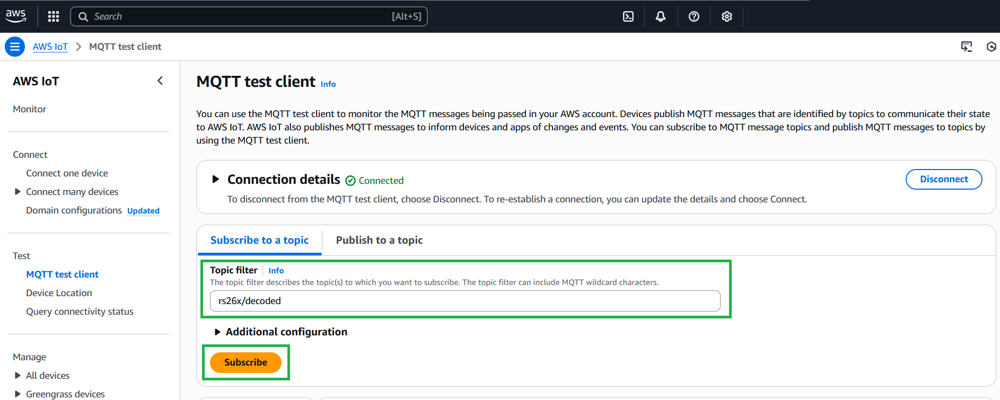

Messages arriving at the root topic include an associated timestamp when the message arrived, as shown below.

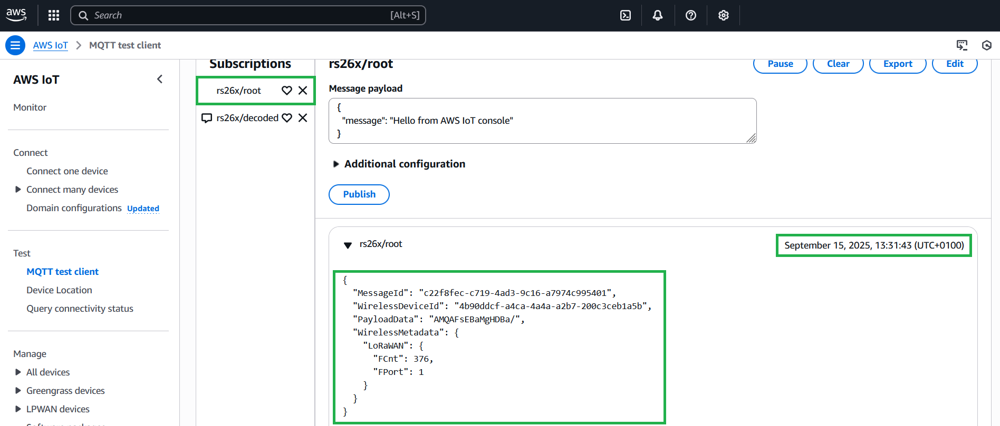

For each message arriving at the root topic, a decoded message will be published to the decoded topic, as shown below.

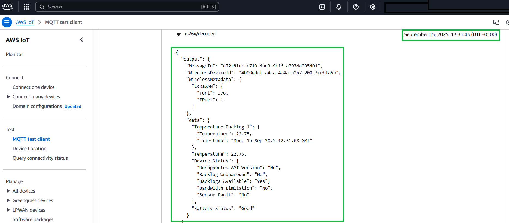

## Adding downlink Encode support

The following describe the steps required to add downlink message encoding.

### Adding the Encoder Lambda

The RS26x_AWS_Downlink file should be added to a new Lambda with a suitable name. The steps described in [Adding the Decoder Lambda function](#adding-the-decoder-lambda-function) should be followed.

### Adding the Encoder Rule

An MQTT topic is used to queue downlink messages for encoding and forwarding to the RS26x device. This is achieved using a Rule as follows.

From the IoT Core tree view, 'Rules' under 'Message routing' should be selected, then 'Create rule' clicked, as shown below.

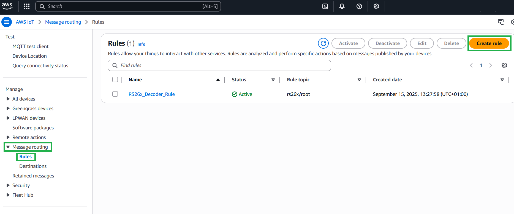

An appropriate name should be entered for the Rule, then 'Next' clicked as shown below.

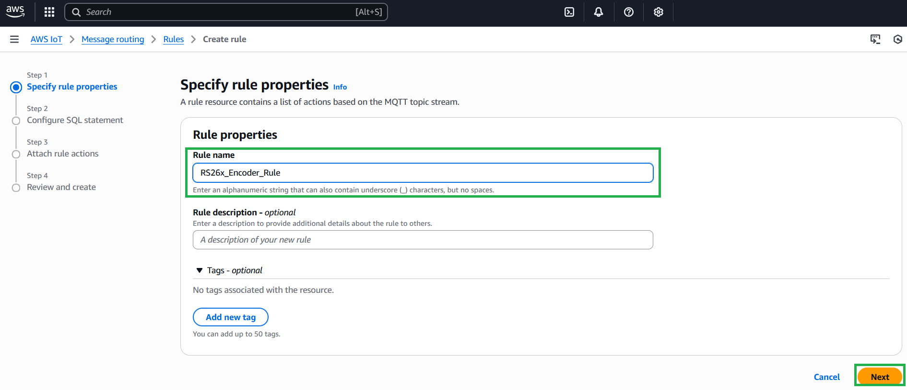

A SQL statement is entered that describes where message encode information is routed from as shown below.

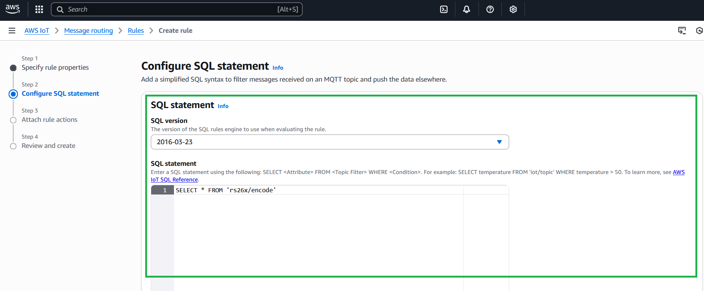

This is of the form as follows.

```
SELECT * FROM '<encode topic>'
```
Text within and including chevrons is intended for replacement. Messages being published to this topic will ultimately invoke the Lambda that encodes downlink messages and adds the encoded message to the IoT Core for LoRaWAN downlink queue.

'Next' can then be clicked.

A single Rule Action is added as shown below.

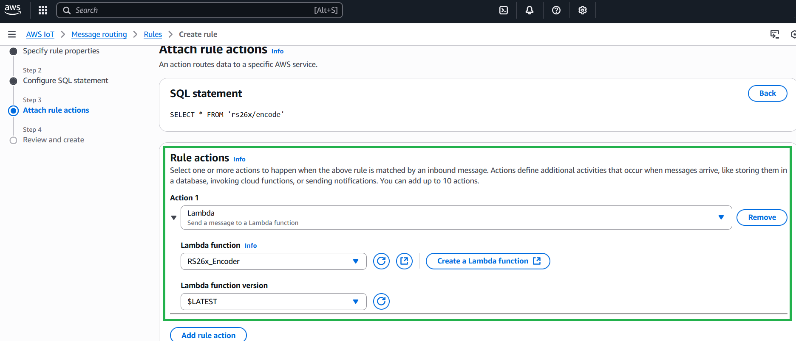

'Action 1' is set to 'Lambda' and the 'Lambda function' to the name of the Encoder Lambda. Other fields can be left at default values. The 'Next' button can then be clicked. The Rule configuration can then be reviewed then the 'Create rule' button clicked.

A summary of available Rules is then displayed as shown below.

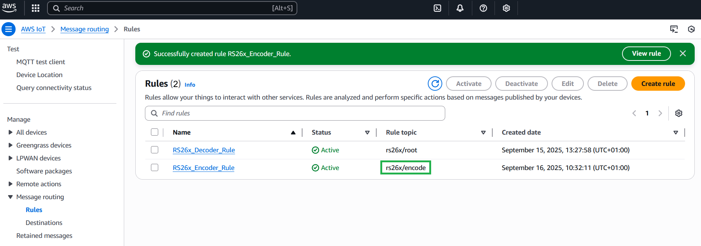

The topic where to publish messages for encoding is displayed for the newly added Rule and should be noted for use later.

The Encoder Lambda needs to have Permissions granted to interact with the IoT Core for LoRaWAN. These are required to allow encoded messages to be added to the IoT Core for LoRaWAN downlink queue. 

The Encoder Lambda page should be opened and the 'Configuration' tab clicked as shown below.

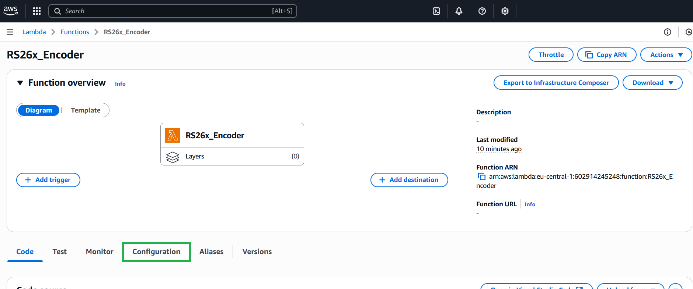

The 'Permissions' item should be clicked as shown below.

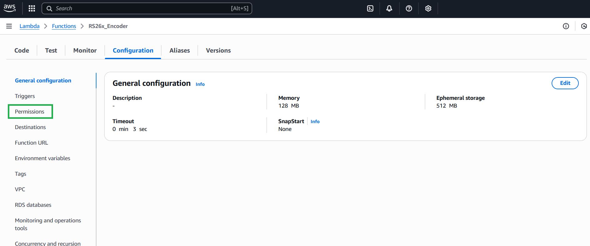

The 'Role name' in the 'Execution Role' group should be clicked as shown below.

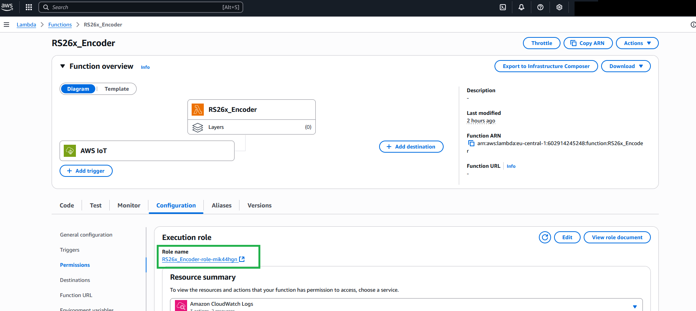

In the 'Permissions' group, 'Create inline policy' under 'Add permissions' should be clicked as shown below.

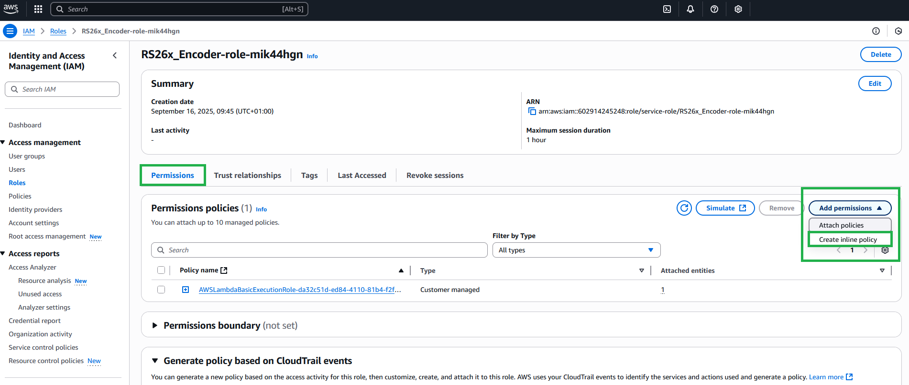

'JSON' should be selected for editing the Policy as shown below.

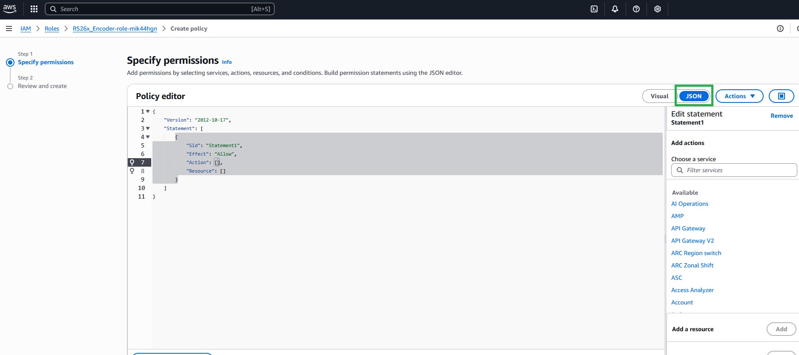

The Policy should be updated then 'Next' clicked as shown below.

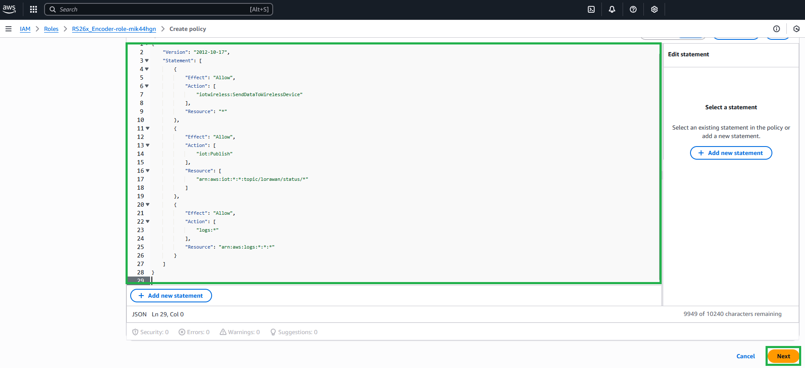

The Policy is of the form shown below. Status messages associated with the encode operations are published to the 'lorawan/status' topic. This can be changed, but must also be changed in the Lambda function code.

```
{
    "Version": "2012-10-17",
    "Statement": [
        {
            "Effect": "Allow",
            "Action": [
                "iotwireless:SendDataToWirelessDevice"
            ],
            "Resource": "*"
        },
        {
            "Effect": "Allow",
            "Action": [
                "iot:Publish"
            ],
            "Resource": [
                "arn:aws:iot:*:*:topic/lorawan/status/*"
            ]
        },
        {
            "Effect": "Allow",
            "Action": [
                "logs:*"
            ],
            "Resource": "arn:aws:logs:*:*:*"
        }
    ]
}
```

A name should be entered for the Policy, then 'Create policy' clicked, as shown below.

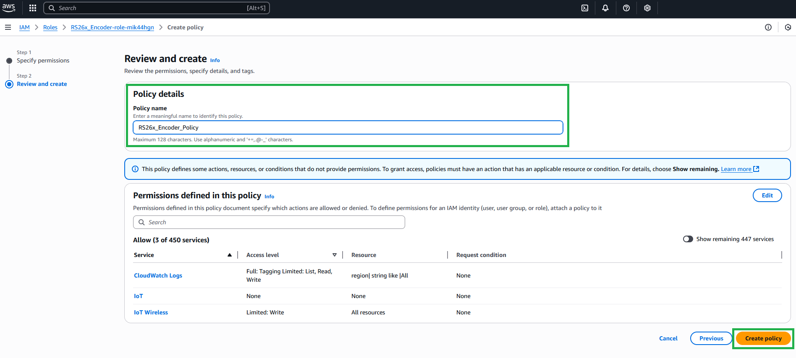

### Sending encoded downlinks to the device

In IoT Core's MQTT Test Client, subscriptions should be created for the Encode and Encode Status topics, as shown below.

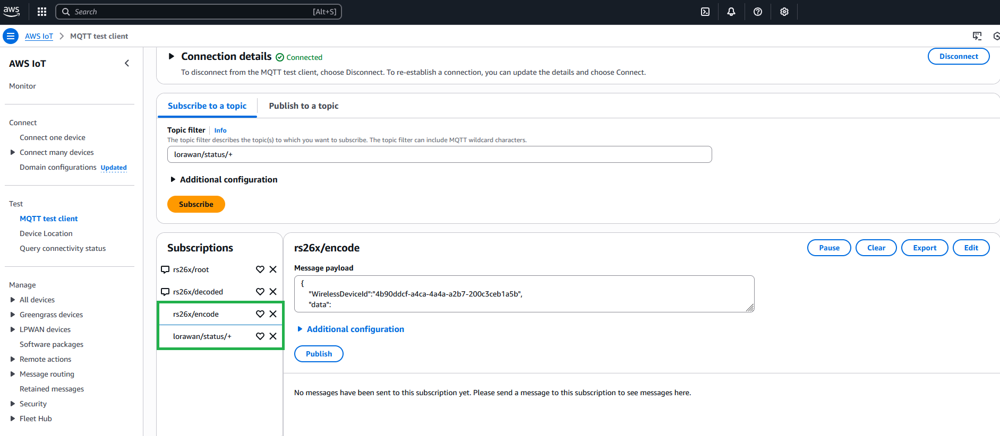

Each device associated with the Destination in use (refer to [Adding a Destination to consume device traffic](#adding-a-destination-to-consume-device-traffic)) is assigned a unique Wireless Device Identifier. The unique identifier for the device being addressed by the downlink is included as part of the MQTT message being published.

From the IoT Core tree view, under 'LPWAN devices', the 'Devices' option should be clicked. This displays the list of available devices, as shown below.

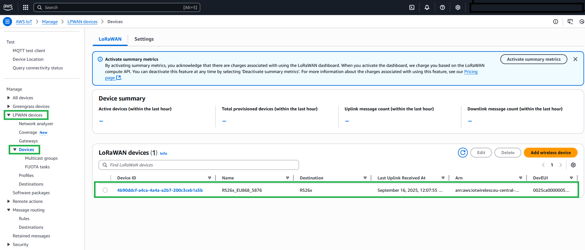

The Device Id of the device being addressed should be clicked. The unique identifier can the be copied using the copy button, as shown below.

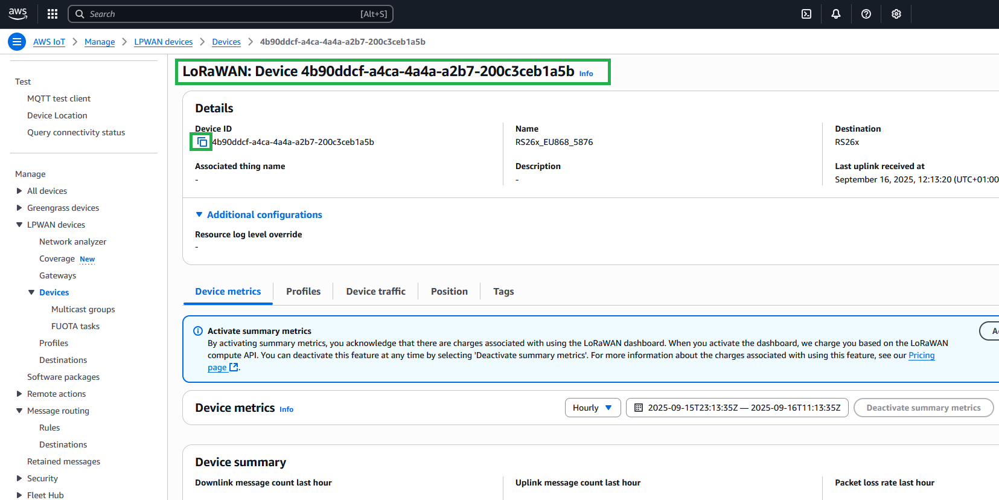

In the MQTT Test Client, messages to be encoded take the form shown below.

```
{
    "WirelessDeviceId":"<wireless device identifier>",
    "data":
    {
        <message to encode>
    }
}
```

Items in and including chevrons are intended for replacement.

Content for the data field is described in depth in the [RS26x Protocol Specification][RS26x LoRa Protocol].

A message to read the device Friendly Name for the device with the identifier 4b90ddcf-a4ca-4a4a-a2b7-200c3ceb1a5b would be entered as follows.

```
{
    "WirelessDeviceId":"4b90ddcf-a4ca-4a4a-a2b7-200c3ceb1a5b",
    "data":
    {
        "Message Type":"Configuration Get",
        "Parameters":[
                         "Friendly Name"
                     ]
    }
}
```

A message to set the device Friendly Name for the same device would be entered as follows.

```
{
    "WirelessDeviceId":"4b90ddcf-a4ca-4a4a-a2b7-200c3ceb1a5b",
    "data":
    {
        "Message Type":"Configuration Set",
        "Friendly Name":"RS26x AWS"
    }
}
```

Messages to be encoded are entered into the 'Message payload' field, then 'Publish' clicked to encode the downlink, as shown below.

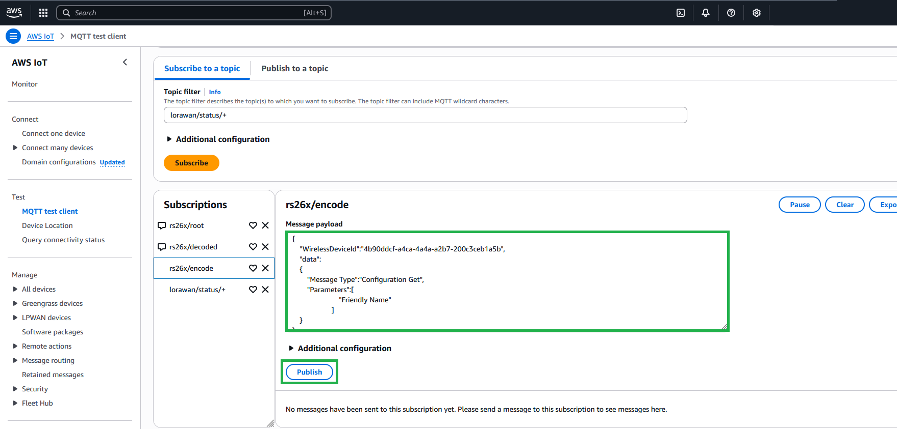

Upon clicking the 'Publish' button, the status of the Encode operation is published to the Encode Status topic, as shown below.

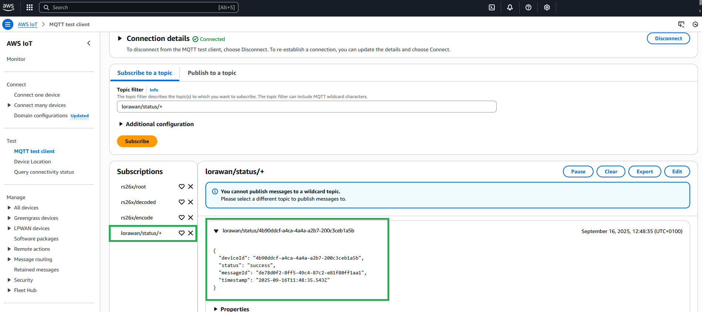

Response uplinks from the device can be inspected in the Decoded topic, as shown below.

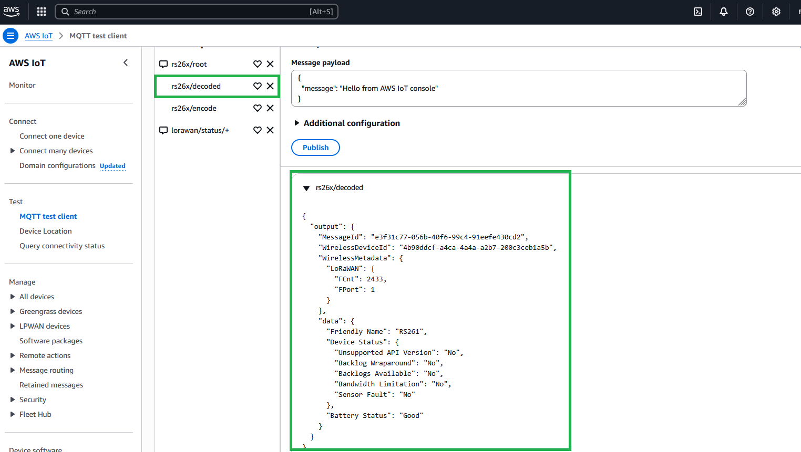

[RS26x product brief]: <https://www.ezurio.com/documentation/product-brief-rs26x-sensor>
[RS26x LoRa Protocol]: <https://www.ezurio.com/documentation/application-note-lora-protocol-rs26x-series>
[AWS IoT Core for LoRaWAN]: <https://aws.amazon.com/iot-core/lorawan/>
[Add destinations to AWS IoT Core for LoRaWAN]: <https://docs.aws.amazon.com/iot-wireless/latest/developerguide/lorawan-create-destinations.html>
[Add device to AWS IoT Core for LoRaWAN]: <https://docs.aws.amazon.com/iot-wireless/latest/developerguide/lorawan-end-devices-add.html>
[Create rules to process LoRaWAN device messages]: <https://docs.aws.amazon.com/iot-wireless/latest/developerguide/lorawan-destination-rules.html>
